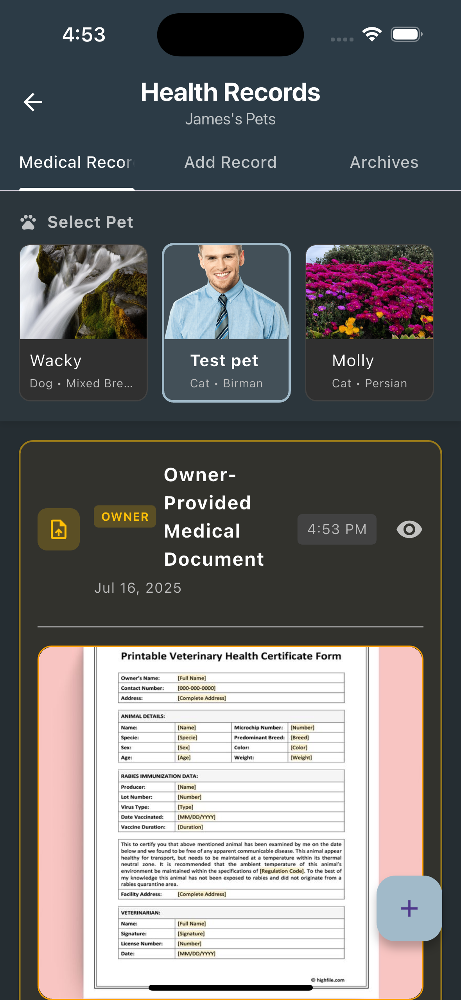

# PetPal 🐾

A comprehensive veterinary clinic management mobile application built with Flutter, connecting pet owners with veterinary professionals through a unified digital platform.

## 📱 Overview

PetPal is a mobile application that digitizes the entire pet care ecosystem. It serves as a bridge between pet owners and veterinary clinics, providing tools for appointment management, medical record keeping, communication, and more.

## 📱 App Screenshots

### Landing Page

  

### Pet Owner Features

  
  
  

  
  
  

### Veterinary Features

  
  
  

  
  
  

## ✨ Key Features

### 🏠 For Pet Owners
- **Pet Profile Management**: Add, edit, and manage multiple pets with detailed information
- **QR Code Generation**: Unique QR codes for each pet for quick identification
- **Appointment Booking**: Schedule and manage veterinary appointments
- **Medical Records**: Digital storage and viewing of pet medical history
- **Medication Tracking**: Monitor medications and schedules
- **Behavior Notes**: Track pet activities and behavioral observations
- **Real-time Messaging**: Direct communication with veterinary staff
- **Document Management**: Upload and share medical documents
- **PDF Generation**: Create shareable pet information reports

### 🏥 For Veterinary Staff
- **Appointment Management**: View and manage clinic appointments
- **QR Code Scanner**: Quick pet identification and information access
- **Medical Record Updates**: Real-time health record maintenance
- **Client Communication**: Messaging system with pet owners
- **Health Record Management**: Comprehensive veterinary documentation

### 💳 Payment Integration
- **Multiple Payment Methods**: Support for GCash, Cash, and other payment options
- **Real-time Payment Status**: Live payment tracking and updates
- **Appointment Fee Management**: Automated fee calculation and processing

## 🛠️ Technical Stack

### Frontend
- **Flutter** - Cross-platform mobile development framework
- **Dart** - Programming language

### Backend & Services
- **Supabase** - Backend-as-a-Service (Authentication, Database, Real-time)
- **Cloudinary** - Image and file storage service
- **PostgreSQL** - Database (via Supabase)

### Key Dependencies
- `supabase_flutter` - Backend integration
- `image_picker` - Photo capture and selection
- `qr_flutter` - QR code generation and scanning
- `pdf` - PDF document generation
- `printing` - Document printing capabilities
- `shared_preferences` - Local data storage
- `permission_handler` - Device permissions management

## 🎯 Core Workflows

### Pet Registration Flow
1. User creates account and logs in
2. Add pet with detailed information
3. Generate unique QR code for pet
4. Pet profile is ready for appointments

### Appointment Flow
1. Pet owner schedules appointment
2. System calculates fees and confirms booking
3. Veterinary staff receives notification
4. QR code scanning for check-in
5. Medical records updated post-visit
6. Payment processing

### Medical Record Management
1. Veterinary staff updates medical records
2. Pet owners can view and download records
3. Documents can be shared via PDF
4. Historical tracking of all medical events

## 📄 License

This project is licensed under the MIT License - see the LICENSE file for details.